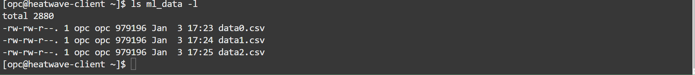
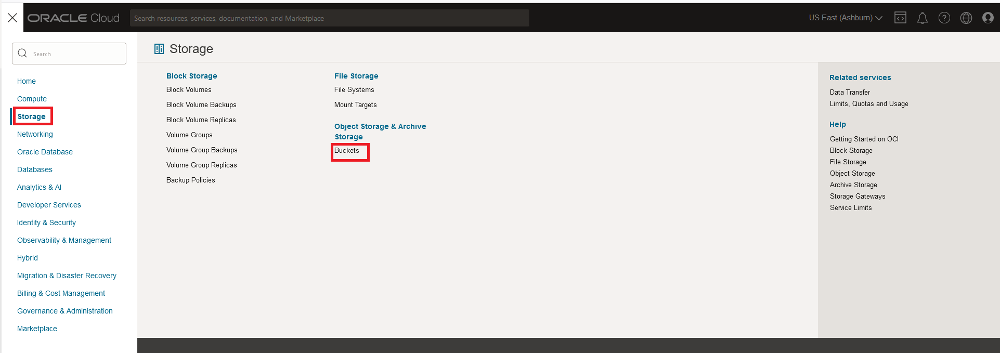
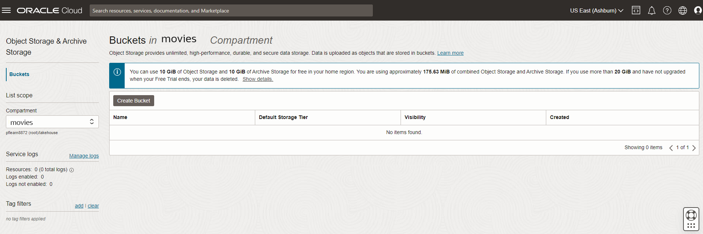
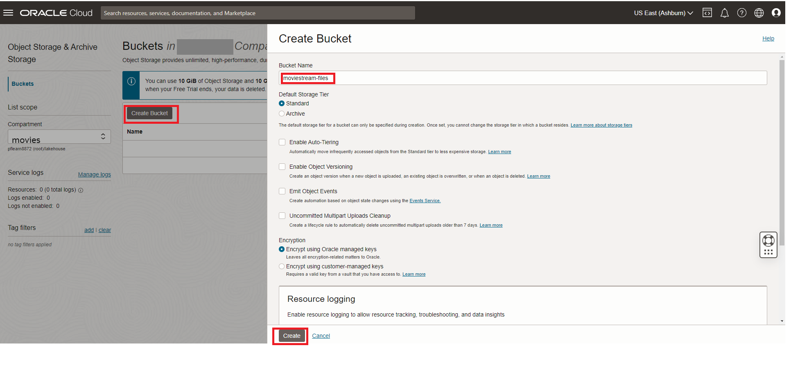
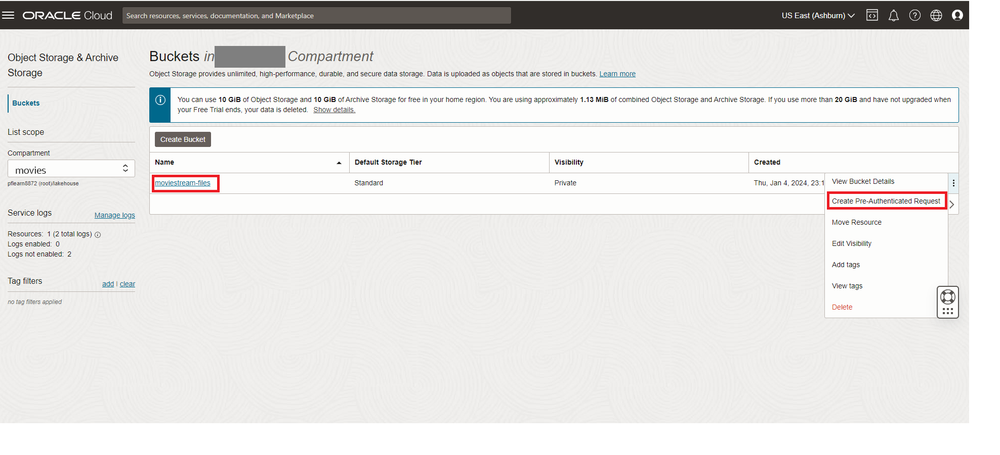
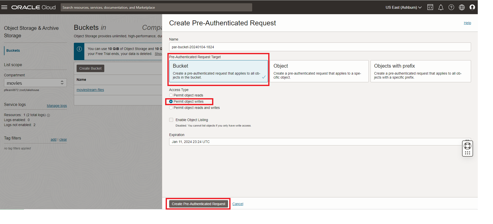
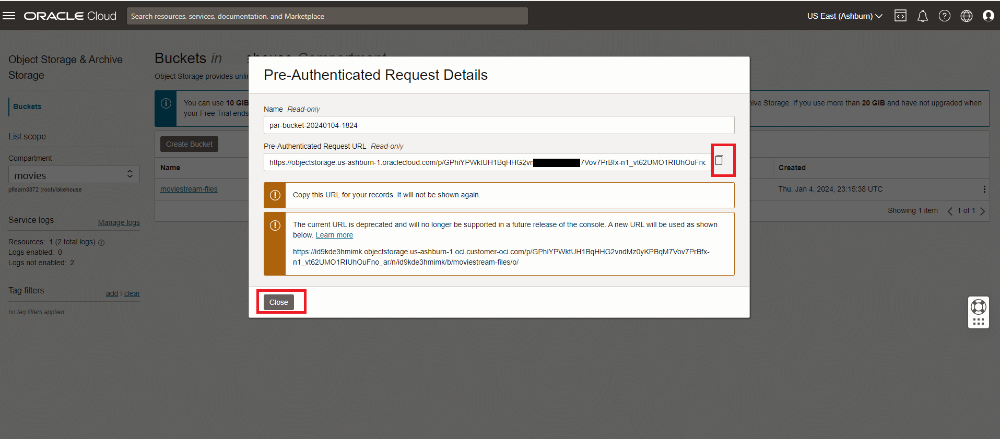
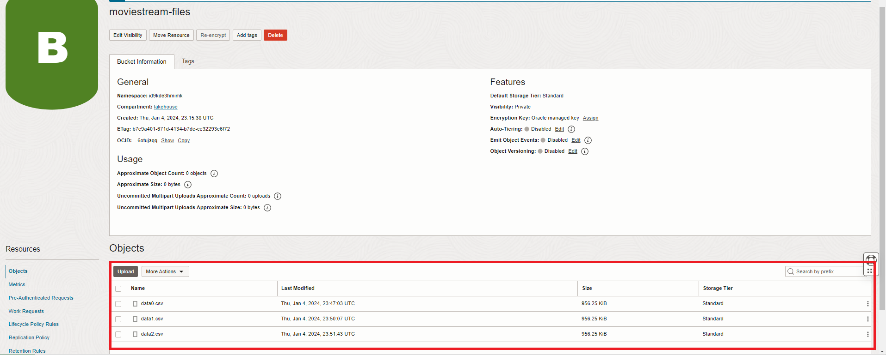

# Upload data to Object Storage for HeatWave Lakehouse

## Introduction

In this lab, you will download the the files needed to train the recommender system model in. You will create an object storage bucket and upload the files to it.

### Objectives

- Download and unzip  the zip file
- Create Object Storage bucket
- Add the data files into  the Bucket using the saved PAR URL

### Prerequisites

- An Oracle Trial or Paid Cloud Account
- Some Experience with MySQL Shell
- Completed Lab 3

## Task 1: Download and unzip  data files

1. If not already connected with SSH, on Command Line, connect to the Compute instance using SSH ... be sure replace the  "private key file"  and the "new compute instance ip"

     ```bash
    <copy>ssh -i ~/.ssh/id_rsa opc@<your_compute_instance_ip></copy>
     ```

2. Download the zip file

    ```bash
    <copy>wget https://objectstorage.us-ashburn-1.oraclecloud.com/p/RK8Xi5q-UxnRlxJdi_Juv3-Y_kmDFRvy1147lPCeo9VwArHTm_NHxoClqf0bst6H/n/mysqlpm/b/mysql_movie_stream/o/ml_data.zip</copy>
     ```

3. Unzip ml_data.zip file which will generate 3 different files

    ```bash
    <copy>unzip ml_data.zip</copy>
     ```

4. List the files

    ```bash
    <copy>ls ml_data -l</copy>
    ```

    

## Task 2: Create Object Storage bucket

1. From the Console navigation menu, click **Storage**.
2. Under Object Storage, click Buckets
    

    **NOTE:** Ensure the correct Compartment is selected : Select **movies**

3. Click Create Bucket. The Create Bucket pane is displayed.

    

4. Enter the Bucket Name **moviestream-files**
5. Under Default Storage Tier, click Standard. Leave all the other fields at their default values.

    

6. Create the  Pre-Authenticated Request URL for the bucket
     - a. Click on the 3 dots to the right of the **moviestream-files** bucket  Click on ‘Create Pre-Authenticated Request’

        

     - b. The ‘Bucket’ option will be pre-selected
     - c. For 'Access Type' select 'Permit object write
     - d. Click the Create "Pre-Authenticated Request' button

        
     - e. Click the ‘Copy’ icon to copy the PAR URL

        

     - f. Save the generated PAR URL; you will need it in the next task

## Task 3: Add files into  the Bucket using the saved PAR URL

1. If not already connected with SSH, on Command Line, connect to the Compute instance using SSH ... be sure replace the  "private key file"  and the "new compute instance ip"

     ```bash
    <copy>ssh -i ~/.ssh/id_rsa opc@<your_compute_instance_ip></copy>
     ```

2. Go into the ml_data folder and list all of the files

    ```bash
    <copy>cd ~/ml_data</copy>
    ```

    ```bash
    <copy>ls -l</copy>
    ```

   

3. Add the data0.csv file to the storage bucket by modifying the following statement with the example below. You must replace the **(PAR URL)** value with the saved generated **PAR URL** from the previous Task.

    ```bash
    <copy>curl -X PUT --data-binary '@data0.csv' (PAR URL)data0.csv</copy>
     ```

     **Example**  
     curl -X PUT --data-binary '@data0.csv' https://objectstorage.us-ashburn-1.oraclecloud.com/p/GPhiYPWktUH1BqHHG2vndMz0yKPBqM7Vov7PrBfx-n1_vt62UMO1RIUhOuFno_ar/n/*****/b/moviestream-files/o/data0.csv

4. Add the data1.csv file to the storage bucket by modifying the following statement with the example below. You must replace the **(PAR URL)** value with the saved generated **PAR URL** from the previous Task.

    ```bash
    <copy>curl -X PUT --data-binary '@data1.csv' (PAR URL)data1.csv</copy>
     ```

     **Example**  
    curl -X PUT --data-binary '@data1.csv' https://objectstorage.us-ashburn-1.oraclecloud.com/p/GPhiYPWktUH1BqHHG2vndMz0yKPBqM7Vov7PrBfx-n1_vt62UMO1RIUhOuFno_ar/n/id9kde3hmimk/b/moviestream-files/o/data1.csv


5. Add the data2.csv file to the storage bucket by modifying the following statement with the example below. You must replace the **(PAR URL)** value with the saved generated **PAR URL** from the previous Task.

    ```bash
    <copy>curl -X PUT --data-binary '@data2.csv' (PAR URL)data2.csv</copy>
     ```

     **Example**  
     curl -X PUT --data-binary '@data2.csv' https://objectstorage.us-ashburn-1.oraclecloud.com/p/GPhiYPWktUH1BqHHG2vndMz0yKPBqM7Vov7PrBfx-n1_vt62UMO1RIUhOuFno_ar/n/id9kde3hmimk/b/moviestream-files/o/data2.csv

6. Your **lakehouse-files** bucket should look like this:
    

You may now **proceed to the next lab**

## Acknowledgements

- **Author** - Perside Foster, MySQL Solution Engineering

- **Contributors** - Abhinav Agarwal, Senior Principal Product Manager, Nick Mader, MySQL Global Channel Enablement & Strategy Manager
- **Last Updated By/Date** - Perside Foster, MySQL Solution Engineering, Jan 2024
