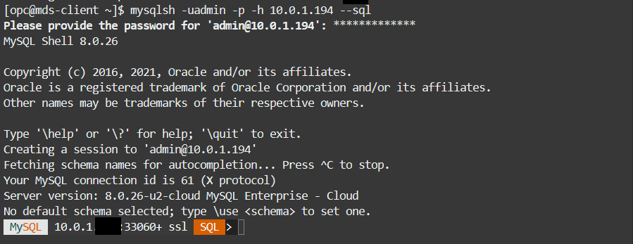
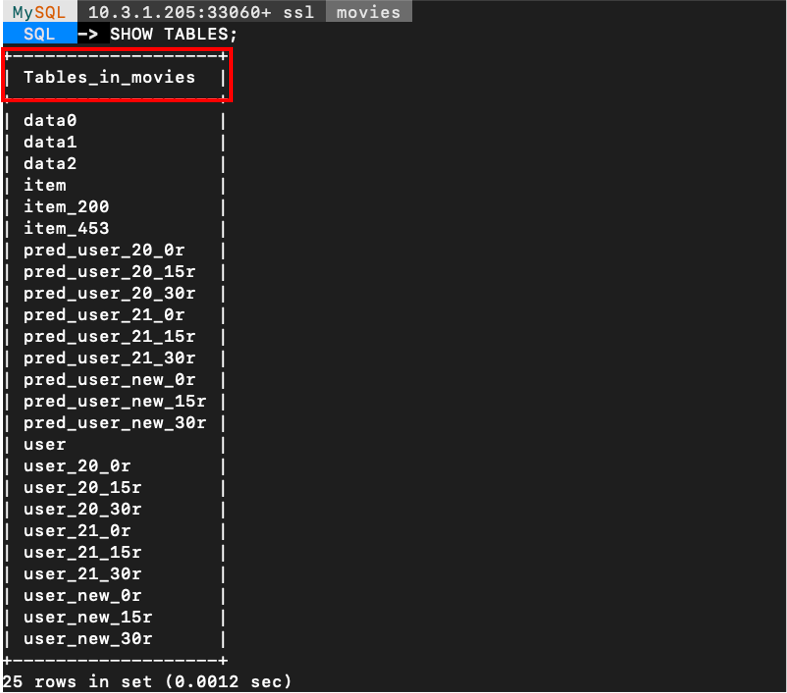

# Generate Predictions fo the Machine Learning models


## Introduction

In this lab, you will generate predictions with **ML\_PREDICT\_TABLE AutoMl function** using the Machine Learning models. These tables will also allow Oracle APEX to consume the data easily with RESTful Services for MySQL HeatWave Database Service.

_Estimated Time:_ 10 minutes

### Objectives

In this lab, you will be guided through the following tasks:

- Create the supporting tables for the predictions tables
- Create the predictions tables

### Prerequisites

- An Oracle Trial or Paid Cloud Account
- Some Experience with MySQL Shell
- Completed Lab 6

## Task 1: Connect with MySQL Shell

1. Go to Cloud shell to SSH into the new Compute Instance

     (Example: **ssh -i ~/.ssh/id_rsa opc@132.145.170...**)

    ```bash
    <copy>ssh -i ~/.ssh/id_rsa opc@<your_compute_instance_ip></copy>
    ```

2. On the command line, connect to MySQL using the MySQL Shell client tool with the following command:

    ```bash
    <copy>mysqlsh -uadmin -p -h 10.... -P3306 --sql </copy>
    ```

    

## Task 2: Generate the USER-ITEM and ITEM-USER Prediction Tables

1. Make sure you are in the movies schema.Enter the following command at the prompt:

    ```bash
    <copy>USE movies;</copy>
    ```

2. Load the movie tables into the HeatWave cluster memory:

    ```bash
    <copy>CALL sys.heatwave_load(JSON_ARRAY('movies'), NULL);</copy>
    ```

3. Load to memory the trained ML models if they are not loaded already

    a. Set the model handle variables for every model

    ```bash
    <copy>
    SET @movies_model_1=(SELECT model_handle FROM ML_SCHEMA_admin.MODEL_CATALOG ORDER BY model_id DESC LIMIT 1 OFFSET 2);

    SET @movies_model_2=(SELECT model_handle FROM ML_SCHEMA_admin.MODEL_CATALOG ORDER BY model_id DESC LIMIT 1 OFFSET 1);

    SET @movies_model_3=(SELECT model_handle FROM ML_SCHEMA_admin.MODEL_CATALOG ORDER BY model_id DESC LIMIT 1 OFFSET 0);
    </copy>
    ```

    b. Hit **ENTER** to execute the last command

    c. Load every model in memory before using them

    ```bash
    <copy>
    CALL sys.ML_MODEL_LOAD(@movies_model_1, NULL);
    CALL sys.ML_MODEL_LOAD(@movies_model_2, NULL);
    CALL sys.ML_MODEL_LOAD(@movies_model_3, NULL);</copy>
    ```

    d. Hit **ENTER** to execute the last command

4. Generate the USER-ITEM table predictions with the trained models:

    a. Use the function ML\_PREDICT\_TABLE to generate the USER-ITEM tables.

    ```bash
    <copy>
    call sys.ML_PREDICT_TABLE('movies.user_20_0r',@movies_model_1,'movies.pred_user_20_0r',NULL);

    call sys.ML_PREDICT_TABLE('movies.user_20_15r',@movies_model_2,'movies.pred_user_20_15r',NULL);

    call sys.ML_PREDICT_TABLE('movies.user_20_30r',@movies_model_3,'movies.pred_user_20_30r',NULL);</copy>
    ```

    Hit **ENTER** to execute the last command

    ```bash
    <copy>
    call sys.ML_PREDICT_TABLE('movies.user_21_0r',@movies_model_1,'movies.pred_user_21_0r',NULL);

    call sys.ML_PREDICT_TABLE('movies.user_21_15r',@movies_model_2,'movies.pred_user_21_15r',NULL);

    call sys.ML_PREDICT_TABLE('movies.user_21_30r',@movies_model_3,'movies.pred_user_21_30r',NULL);</copy>
    ```

    Hit **ENTER** to execute the last command

    ```bash
    <copy>
    call sys.ML_PREDICT_TABLE('movies.user_new_0r',@movies_model_1,'movies.pred_user_new_0r',NULL);

    call sys.ML_PREDICT_TABLE('movies.user_new_15r',@movies_model_2,'movies.pred_user_new_15r',NULL);

    call sys.ML_PREDICT_TABLE('movies.user_new_30r',@movies_model_3,'movies.pred_user_new_30r',NULL);</copy>
    ```

    Hit **ENTER** to execute the last command

    b. Show the tables generated up until now

    ```bash
    <copy>USE movies;
    SHOW TABLES;
    </copy>
    ```

    

5. Generate the ITEM-USER table predictions with the trained models:

    a.

    ```bash
    <copy>
    call sys.ML_PREDICT_TABLE('movies.item_200',@movies_model_1,'movies.pred_item_200',NULL);

    call sys.ML_PREDICT_TABLE('movies.item_453',@movies_model_1,'movies.pred_item_453',NULL);</copy>
    ```

    b. Hit **ENTER** to execute the last command

6. To avoid consuming too much space, it is good practice to unload a model when you are finished using it.

    a. Unload all three models from memory

    ```bash
    <copy>
    CALL sys.ML_MODEL_UNLOAD(@movies_model_1);
    CALL sys.ML_MODEL_UNLOAD(@movies_model_2);
    CALL sys.ML_MODEL_UNLOAD(@movies_model_3);</copy>
    ```

    b. Hit **ENTER** to execute the last command

You may now **proceed to the next lab**

## Learn More

- [Oracle Cloud Infrastructure MySQL Database Service Documentation](https://docs.oracle.com/en-us/iaas/mysql-database/index.html)
- [MySQL HeatWave ML Documentation] (https://dev.mysql.com/doc/heatwave/en/mys-hwaml-machine-learning.html)


## Acknowledgements

- **Author** - Perside Foster, MySQL Principal Solution Engineering
- **Contributors** - Mandy Pang, MySQL Principal Product Manager,  Nick Mader, MySQL Global Channel Enablement & Strategy Manager
- **Last Updated By/Date** - Perside Foster, MySQL Solution Engineering, August 2023
