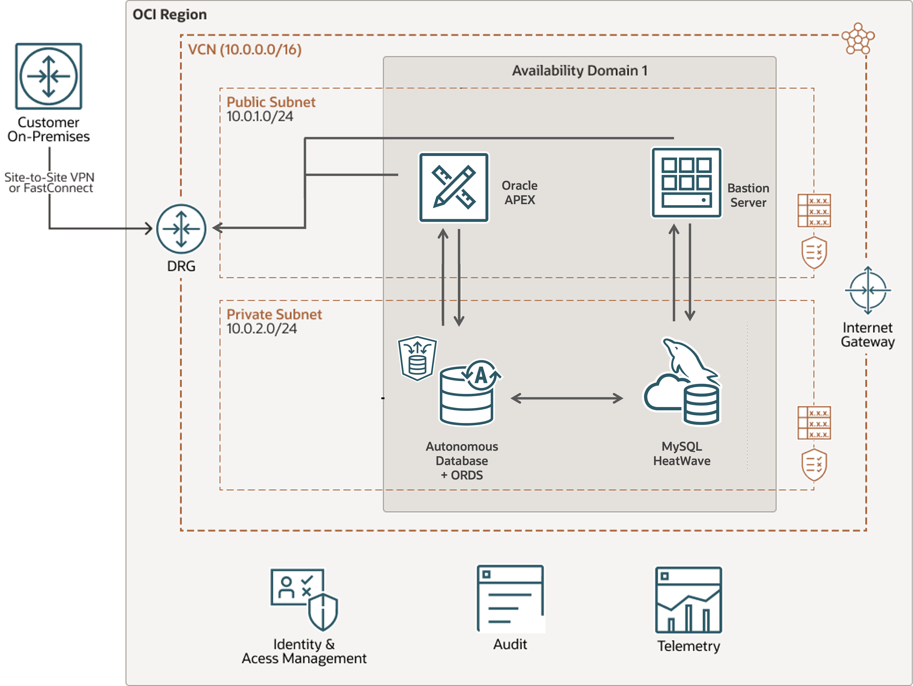

# Introduction

## About this Workshop

Welcome to this workshop in which you’ll follow step-by-step instructions to build the MovieHub application powered by MySQL HeatWave. MovieHub is a fictitious movie streaming application that delivers personalized recommendations using machine learning. It leverages the built-in HeatWave AutoML recommender system to predict, for example, movies that a user will like, or to which users a given movie should be promoted. You’ll build this app using the most popular low-code development platform, Oracle APEX, which will also enable you to create analytics dashboards in the application. You’ll develop a few scenarios both from the user's and the administrator's perspective.

_Estimated Lab Time:_ 2.5 hours

_Lab Setup

## About Product/Technology

MySQL HeatWave Lakehouse allows you to query data in object storage, MySQL databases, or a combination of both with record speed—and automatically build, train, run, and explain machine learning (ML) models. It’s available on Oracle Cloud Infrastructure (OCI), Amazon Web Services (AWS), and Microsoft Azure.

### Why MySQL HeatWave Lakehouse?

#### Query non-MySQL and MySQL workloads

Query processing is done entirely within the HeatWave engine, so you can take advantage of MySQL HeatWave Lakehouse for non-MySQL workloads as well as MySQL-compatible workloads.

#### Get the best performance and price-performance

The query performance of MySQL HeatWave Lakehouse is 9X faster than Amazon Redshift, 17X faster than Snowflake, 17X faster than Databricks, and 36X faster than Google BigQuery, per a 500 TB TPC-H benchmark. Price-performance is also significantly better.

#### Use built-in ML with all your data, plus generative AI

Automate the pipeline to build, train, deploy, and explain ML models using data in object storage and MySQL Database, without moving the data to a separate ML cloud service and at no additional cost. Interact with HeatWave Lakehouse using natural language.

## Objectives

In this workshop, you will use OCI, MySQL HeatWave, and Oracle APEX to build the MovieHub application and generate personalized recommendations.

1. Create MySQL HeatWave Database System
2. Setup a HeatWave Cluster for OLAP/AutoML
3. Create Bastion Server for MySQL Data
4. Upload data to Object Storage for HeatWave Lakehouse
5. Load CSV data from OCI Object Store to Lakehouse
6. Create and test HeatWave AutoML Recommender System
7. Generate Predictions using the Machine Learning models for the Movie App
8. Query Information from the movies and predictions tables
9. Create a Low Code Application with Oracle APEX and REST SERVICES for MySQL
10. Setup the APEX Application and Workspace
11. Explore the Movie Recommendation App with data inside MySQL HeatWave

## Prerequisites

- An Oracle Free Tier, Paid or LiveLabs Cloud Account
- Some Experience with MySQL Shell - [MySQL Site](https://dev.MySQL.com/doc/MySQL-shell/8.0/en/).

You may now **proceed to the next lab**

## Acknowledgements

- **Author** - Cristian Aguilar, MySQL Solution Engineering
- **Contributors** - Perside Foster, MySQL Principal Solution Engineering
- **Last Updated By/Date** - Perside Foster, MySQL Principal Solution Engineering, January 2024

- **Dataset** - F. Maxwell Harper and Joseph A. Konstan. 2015. The MovieLens Datasets:
History and Context. ACM Transactions on Interactive Intelligent
Systems (TiiS) 5, 4, Article 19 (December 2015), 19 pages.
DOI=http://dx.doi.org/10.1145/2827872