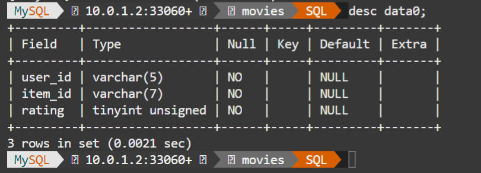
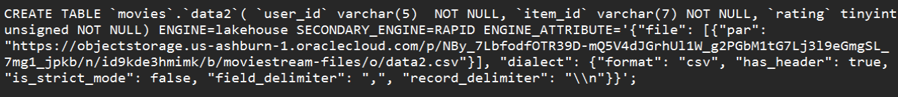

# Load CSV data from OCI Object Store to Lakehouse - movies

## Introduction

To load data from Object Storage to HeatWave, you need to specify the location of the file or folder objects in your Object Storage.

1. Use [Resource Principal](https://docs.oracle.com/en-us/iaas/autonomous-database-serverless/doc/resource-principal-enable.html) - It is recommended that you use Resource Principal-based approach for access to data in Object Storage for more sensitive data as this approach is more secure.

2. Use [Pre-Authenticated Request URLs (PARs)](https://docs.oracle.com/en-us/iaas/Content/Object/Tasks/usingpreauthenticatedrequests.htm) - If you choose to use PARs, we recommend that you use read-only PARs with Lakehouse and specify short expiration dates for your PARs. The expiration dates should align with your loading schedule.

Since we are using example data, we will make use of PAR in this LiveLab. We already have the required "movies" schema  loaded when the HeatWave database was created.

We will now create the machine learning training tables from the Object Store.

### Objectives

- Create PAR Link for the  "moviestream-files" bucket for all thre files.
- Run Autoload to infer the schema and estimate capacity
- Load complete machine learning training tables from Object Store into HeatWave Lakehouse

### Prerequisites

- An Oracle Trial or Paid Cloud Account
- Some Experience with MySQL Shell
- Completed Lab 4

## Task 1: Create the PAR Link for the "moviestream-files" bucket

1. Create a PAR URL for the **data0.csv** object

    - a. From your OCI console, navigate to your lakehouse-files bucket in OCI.
    - b. Select the data0.csv file and click the three vertical dots.

        

    - c. Click on ‘Create Pre-Authenticated Request’
    - d. Click to select the ‘Object’ option under ‘PreAuthentcated Request Target’.
    - e. Leave the ‘Access Type’ option as-is: ‘Permit object reads’.
    - h. Click the ‘Create Pre-Authenticated Request’ button.

       

    - i. Click the ‘Copy’ icon to copy the PAR URL.
    - j. Save the generated PAR URL; you will need it later.

2. Do the same process to create a PAR URL for **data1.csv** by performaing the following tasks:
    - a. From your OCI console, navigate to your lakehouse-files bucket in OCI.
    - b. Select the data1.csv file and click the three vertical dots.
    - c. Click on ‘Create Pre-Authenticated Request’
    - d. Click to select the ‘Object’ option under ‘PreAuthentcated Request Target’.
    - e. Leave the ‘Access Type’ option as-is: ‘Permit object reads’.
    - h. Click the ‘Create Pre-Authenticated Request’ button.
    - i. Click the ‘Copy’ icon to copy the PAR URL.
    - j. Save the generated PAR URL; you will need it later.

3. Do the same process to create a PAR URL for **data2.csv** by performaing the following tasks:
    - a. From your OCI console, navigate to your lakehouse-files bucket in OCI.
    - b. Select the data1.csv file and click the three vertical dots. 
    - c. Click on ‘Create Pre-Authenticated Request’
    - d. Click to select the ‘Object’ option under ‘PreAuthentcated Request Target’.
    - e. Leave the ‘Access Type’ option as-is: ‘Permit object reads’.
    - h. Click the ‘Create Pre-Authenticated Request’ button.
    - i. Click the ‘Copy’ icon to copy the PAR URL.
    - j. Save the generated PAR URL; you will need it later.

4. You should have generated and saved three different PAR URL; you will need them in the next tasks. They should look like this:


## Task 2: Connect to your MySQL HeatWave system using Cloud Shell

1. If not already connected with SSH, on Command Line, connect to the Compute instance using SSH ... be sure replace the  "private key file"  and the "new compute instance ip"

     ```bash
    <copy>ssh -i ~/.ssh/id_rsa opc@<your_compute_instance_ip></copy>
     ```

2. If not already connected to MySQL then connect to MySQL using the MySQL Shell client tool with the following command:

    ```bash
    <copy>mysqlsh -uadmin -p -h 10.0.1... --sql </copy>
    ```

    

3. List schemas in your heatwave instance

    ```bash
    <copy>show databases;</copy>
    ```

    

4. Set default schema

    ```bash
    <copy>use movies;</copy>
    ```

5. List the movies schema tables.

    ```bash
    <copy>show tables;</copy>
    ```

    


    You are now ready to use Autoload to load a table from the object store into MySQL HeatWave Lakehouse

## Task 3: Run Autoload to infer the schema and estimate capacity for the data0 tables in the Object Store

1. The data is contained in the data0.csv file in object store for which we have created a PAR URL in the earlier task. Enter the following commands one by one and hit Enter.

2. This sets the schema we will load table data into. Don’t worry if this schema has not been created. Autopilot will generate the commands for you to create this schema if it doesn’t exist.

    ```bash
    <copy>SET @db_list = '["movies"]';</copy>
    ```

3. This sets the parameters for the table name we want to load data into and other information about the source file in the object store. Substitute the **(PAR URL)** below with the one you generated in the previous task:

    ```bash
    <copy>SET @dl_tables = '[{
    "db_name": "movies",
    "tables": [{
        "table_name": "data0",
        "dialect": {
            "format": "csv",
            "field_delimiter": ",",
            "record_delimiter": "\\n",
            "has_header": true,
            "is_strict_mode": false},
            "file": [{"par": "(PAR URL)"}]
        }
    ]}
    ]';</copy>
    ```

    - It should look like the following example (Be sure to include the PAR Link inside at of quotes("")):

    

4. This command populates all the options needed by Autoload:

    ```bash
    <copy>SET @options = JSON_OBJECT('mode', 'dryrun', 'policy', 'disable_unsupported_columns', 'external_tables', CAST(@dl_tables AS JSON));</copy>
    ```

5. Run this Autoload command:

    ```bash
    <copy>CALL sys.heatwave_load(@db_list, @options);</copy>
    ```

6. Once Autoload completes running, its output has several pieces of information:
    - a. Whether the table exists in the schema you have identified.
    - b. Auto schema inference determines the number of columns in the table.
    - c. Auto schema sampling samples a small number of rows from the table and determines the number of rows in the table and the size of the table.
    - d. Auto provisioning determines how much memory would be needed to load this table into HeatWave and how much time loading this data take.


    

7. Autoload also generated a statement like the one below. Execute this statement now.

    ```bash
    <copy>SELECT log->>"$.sql" AS "Load Script" FROM sys.heatwave_autopilot_report WHERE type = "sql" ORDER BY id;</copy>
    ```


8. The execution result contains the SQL statements needed to create the table and then load this table data from the Object Store into HeatWave.

    

9. Copy the **CREATE TABLE** command from the results.
10. Replace the following column values:
    - a.  `user_id` from smallint unsigned to **varchar(5)**
    - b. `item_id` from smallint unsigned to **varchar(7)**

11. The create command should look lie this:

    

12. Execute the **CREATE TABLE** command to create the data0 table.
13. The result should look lie this
    

## Task 4: Load the data0 table from Object Store into MySQL HeatWave

1. Run this command to see the table structure created.

    ```bash
    <copy>desc data0;</copy>
    ```

    

2. Now load the data from the Object Store file into the table.

    ```bash
    <copy> ALTER TABLE /*+ AUTOPILOT_DISABLE_CHECK */ `movies`.`data0` SECONDARY_LOAD;  </copy>
    ```

3. Check the number of rows loaded into the table.

    ```bash
    <copy>select count(*) from data0;</copy>
    ```

    The data0 table has 100000 rows.

4. View a sample of the data in the table.

    ```bash
    <copy>select * from data0 limit 5;</copy>
    ```

    

## Task 5: Create and Load the data1 table from Object Store into MySQL HeatWave

1. Create the data1 table by copying the data0 Create command and replace the  (PAR URL) with the data.csv PAR URL  you saved earlier. It will be the source for the data1.csv table:

    ```bash
    <copy>CREATE TABLE `movies`.`data1`( `user_id` varchar(5)  NOT NULL, `item_id` varchar(7) NOT NULL, `rating` tinyint unsigned NOT NULL) ENGINE=lakehouse SECONDARY_ENGINE=RAPID ENGINE_ATTRIBUTE='{"file": [{"par": "(PAR URL)"}], "dialect": {"format": "csv", "has_header": true, "is_strict_mode": false, "field_delimiter": ",", "record_delimiter": "\\n"}}';</copy>
    ```

    - It should look like the following example. Be sure to replace the (PAR URL) value with  data1.csv PAR Link. The command should look like this. Then execute it.

    

2. Run this command to see the table structure created:

    ```bash
    <copy>desc data1;</copy>
    ```

3. Load the data from the Object Store into the data1 table.

    ```bash
    <copy>ALTER TABLE /*+ AUTOPILOT_DISABLE_CHECK */ `movies`.`data1` SECONDARY_LOAD; </copy>
    ```

4. Once Autoload completes, check the number of rows loaded into the table.

    ```bash
    <copy>select count(*) from data1;</copy>
    ```

    The data1 table has 100000 rows.

5. View a sample of the data in the table.

    ```bash
    <copy>select * from data1 limit 5;</copy>
    ```

    


## Task 6: Create and Load the data2 table from Object Store into MySQL HeatWave

1. Create the data2 table by copying the data0 Create command and replace the  (PAR URL) with the data.csv PAR URL  you saved earlier. It will be the source for the data2.csv table:

    ```bash
    <copy>CREATE TABLE `movies`.`data2`( `user_id` varchar(5)  NOT NULL, `item_id` varchar(7) NOT NULL, `rating` tinyint unsigned NOT NULL) ENGINE=lakehouse SECONDARY_ENGINE=RAPID ENGINE_ATTRIBUTE='{"file": [{"par": "(PAR URL)"}], "dialect": {"format": "csv", "has_header": true, "is_strict_mode": false, "field_delimiter": ",", "record_delimiter": "\\n"}}';</copy>
    ```

    - It should look like the following example. Be sure to replace the (PAR URL) value with  data2.csv PAR Link. The command should look like this. Then execute it.

    

2. Run this command to see the table structure created:

    ```bash
    <copy>desc data2;</copy>
    ```

3. Load the data from the Object Store into the data2 table.

    ```bash
    <copy>ALTER TABLE /*+ AUTOPILOT_DISABLE_CHECK */ `movies`.`data2` SECONDARY_LOAD; </copy>
    ```

4. Once Autoload completes, check the number of rows loaded into the table.

    ```bash
    <copy>select count(*) from data2;</copy>
    ```

    The data2 table has 100000 rows.

5. View a sample of the data in the table.

    ```bash
    <copy>select * from data2 limit 5;</copy>
    ```

    

You may now **proceed to the next lab**

## Acknowledgements

- **Author** - Perside Foster, MySQL Solution Engineering

- **Contributors** - Abhinav Agarwal, Senior Principal Product Manager, Nick Mader, MySQL Global Channel Enablement & Strategy Manager , Cristian Aguilar, MySQL Solution Engineering
- **Last Updated By/Date** - Perside Foster, MySQL Solution Engineering, Jan 2024
